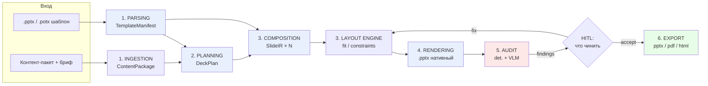

# ARCHITECTURE.md — DeckForge

> Сервис автоматической генерации презентаций в стиле произвольного шаблона.
> Кейс «Цифровой дизайнер презентаций», ЛЦТ.

Этот документ — **рабочая инструкция для AI-агента-исполнителя и для команды**. Он задаёт
границы слоёв, контракты между ними, правила работы по SDD (OpenSpec), состав зависимостей
и порядок реализации. Всё, что не описано здесь, сначала оформляется как OpenSpec-предложение,
и только потом кодируется.

---

## 0. Как агенту пользоваться этим документом

1. Прочитать §1 (ограничения) и §2 (ключевые решения) — они не подлежат пересмотру без ADR.
2. Прочитать §3–§6 — контракты и структура репозитория. Код пишется строго в эти границы.
3. Работать по циклу OpenSpec из §7. **Код без принятого change-предложения не пишется.**
4. Зависимости добавлять только через Poetry (§8), версии фиксировать в `poetry.lock`.
4.1 Локально ничего не ставить использовать podman
5. Порядок работ — §14. Идти сверху вниз, не перепрыгивая через этапы.

**Правило остановки:** если требование задачи противоречит этому документу — не «чинить на ходу»,
а создать change-предложение `/opsx:propose` с обоснованием и обновить ARCHITECTURE.md в том же change.

---

## 1. Контекст и жёсткие ограничения

Из ТЗ. Нарушение любого пункта — дисквалификация или потеря баллов.

| # | Ограничение | Как обеспечивается в архитектуре |
|---|---|---|
| C1 | Только open-weights модели, лицензия **Apache-2.0 / MIT** | Реестр моделей `configs/models.yaml` + CI-проверка лицензий (§9) |
| C2 | LLM/VLM ≤ **35B**, text-to-image ≤ **20B** | Там же; в реестре поле `params_total_b` с валидацией |
| C3 | Слайды в `.pptx` — **нативными объектами**, не растром | Рендерер только через python-pptx; детерминированная проверка `integrity.slide_is_image` |
| C4 | Экспорт `.pptx`, `.pdf`, `.html` | Слой `export`, три адаптера от одного IR |
| C5 | Колода 10–15 слайдов за **≤ 5 минут** | Бюджет времени по стадиям (§12), параллелизм по слайдам, prefix caching |
| C6 | Работа с **ранее не виденным** шаблоном | Запрет хардкода: линтер `no-template-constants` + e2e на «холодном» шаблоне (§13) |
| C7 | **3 варианта вёрстки** одного контента на одном шаблоне | Ось вариативности в `configs/variants.yaml`, один прогон — три IR |
| C8 | Аудит — **часть пайплайна**, детерминированные + контекстуальные проверки | Слой `audit`, реестр проверок, HITL-узел в графе |
| C9 | Промпты и конфиги скиллов — **отдельными файлами**, не в коде | `prompts/` + `skills/` с семверсией, загрузка через реестр (§9) |
| C10 | Стек: Python / TypeScript; фронт React/Next/Vue/Streamlit/Gradio | Python 3.12 бэкенд, Streamlit для MVP → Next.js на финал |
| C11 | Воспроизводимый запуск конфиг-файлом | `configs/*.yaml` + `docker compose up`, всё детерминировано seed'ом |

---

## 2. Ключевые архитектурные решения (ADR-сводка)

Каждое решение — с обоснованием и с условием пересмотра. Полные ADR лежат в `docs/adr/`.

### ADR-001. Маршрут генерации: LLM → строгий JSON-IR → детерминированный рендерер

**Решение.** LLM **никогда не пишет .pptx и не пишет код вёрстки**. LLM производит только
валидируемый JSON (`SlideIR`). Сборку файла делает детерминированный рендерер на `python-pptx`.

**Почему не альтернативы:**

| Маршрут | Вердикт |
|---|---|
| HTML/CSS → конвертация в pptx (Marp, Slidev, Reveal) | ❌ Конвертеры кладут слайд растром или ломают объекты → нарушение C3 |
| LLM пишет Python-код → sandbox (подход AutoPresent/SlidesLib) | ⚠️ Fallback. Модели ≤35B нестабильно пишут исполняемый код вёрстки; нужна песочница и retry-циклы, которые съедают бюджет C5 |
| **LLM → JSON-IR → рендерер** | ✅ Схема валидируется constrained decoding, ошибка ловится до записи файла, аудит работает по геометрии, воспроизводимо |

**Условие пересмотра:** если на «холодном» шаблоне рендерер не покрывает > 20 % макетов —
включаем маршрут кодогенерации как fallback для непокрытых случаев (change `add-codegen-fallback`).

### ADR-002. Соответствие шаблону через наследование, а не через копирование значений

Слайд **всегда** создаётся на макете из шаблона (адрес — `LayoutSpec.part_name`,
имя части пакета; `slide_layouts[i]` для этого не годится, см. ADR-002), текст кладётся в
плейсхолдеры, цвета задаются ссылками на тему (`MSO_THEME_COLOR.ACCENT_1`), а не литеральными RGB.
Это даёт автоматическое соответствие палитре и типографике любого шаблона и делает C6 достижимым.

Литеральный цвет/шрифт в коде рендерера = ошибка линтера.

### ADR-003. Дизайн-система — отдельный артефакт (`TemplateManifest`)

Парсинг шаблона отделён от генерации. Результат парсинга — самодостаточный JSON, кэшируемый
по SHA-256 файла. Генерация **не имеет доступа к .pptx-шаблону**, только к манифесту.
Это принудительно отделяет «понимание шаблона» от «наполнения» и делает обе части тестируемыми.

### ADR-004. Двухуровневый аудит с приоритетом детерминированного

Детерминированные проверки — чистые функции над `SlideIR` + OOXML-геометрией, без модели,
всегда одинаковый результат. Контекстуальные — VLM по рендеру слайда. Порядок: сначала
детерминированные (дёшево, чинится автоматически), затем VLM (дорого, чинится через HITL).

### ADR-005. Варианты вёрстки — параметр, а не отдельный пайплайн

Три варианта = три прохода одного графа с разными `VariantProfile`. Оси различий объявлены
декларативно (§11). Никакого дублирования кода.

### ADR-006. Оркестрация на LangGraph

Нужны: ветвление, циклы self-correction, human-in-the-loop (пользователь выбирает, что чинить),
чекпойнты долгой задачи. LangGraph покрывает всё это из коробки. Узлы графа — тонкие обёртки
над сервисами слоёв; бизнес-логика в графе не живёт.

**Правка change (17).** Виток починки ведёт из HITL не в композицию, а в слой вёрстки:
`FixApplier` возвращает готовый `DeckIR`, и повторный вызов композиции сходил бы в модель
заново и выбросил бы только что применённый фикс. Заново проходятся вписывание, запись
и аудит — только они видят последствия правки.

---

## 3. Слоистая архитектура

Пять слоёв с односторонними зависимостями. **Слой не импортирует слой выше себя.**
`domain` не импортирует ничего инфраструктурного.



| Слой | Пакет | Ответственность | Что ему запрещено |
|---|---|---|---|
| **domain** | `deckforge.domain` | Pydantic-модели IR, enum'ы, чистые правила | Любой I/O, любые сторонние SDK |
| **parsing** | `deckforge.parsing` | .pptx/.potx → `TemplateManifest`; контент → `ContentPackage` | Обращаться к LLM для вёрстки; знать про итоговый файл |
| **planning** | `deckforge.planning` | бриф + контент + манифест → `DeckPlan` (состав и порядок слайдов) | Знать про EMU, координаты, python-pptx |
| **composition** | `deckforge.composition` | `DeckPlan` + манифест → `SlideIR[]`; подбор макета, распределение контента, выбор визуализации | Писать в файл |
| **layout** | `deckforge.layout` | Вписывание текста, constraint-решатель, авто-кегль, детект переполнения до записи | Вызывать LLM |
| **rendering** | `deckforge.rendering` | `SlideIR` → объекты python-pptx (текст, chart, table, фигуры, иконки, картинки) | Принимать решения о содержании |
| **audit** | `deckforge.audit` | Реестр проверок, рендер превью, VLM-судья, авто-фиксы | Молча менять слайд без записи finding |
| **export** | `deckforge.export` | pptx / pdf / html из одного источника | Пересобирать контент |
| **inference** | `deckforge.inference` | Клиент LLM/VLM/T2I, structured output, кэш, ретраи | Содержать промпты (они в `prompts/`) |
| **pipeline** | `deckforge.pipeline` | LangGraph-граф, состояние, HITL, чекпойнты | Бизнес-логика слоёв |
| **api / cli / ui** | `deckforge.api`, `.cli`, `frontend/` | Транспорт | Что-либо кроме вызова pipeline |

---

## 4. Контракты между слоями

Единственный способ передачи данных между слоями — Pydantic-модели из `deckforge.domain`.
JSON-схемы генерируются из них и лежат в `schemas/` (артефакт сборки, в git попадают
как golden-файлы для контроля обратной совместимости).

### 4.1 `TemplateManifest` — выход парсинга

```jsonc
{
  "template_id": "sha256:9f2c…",
  "source_name": "corporate_template.pptx",
  "slide_size": { "cx_emu": 12192000, "cy_emu": 6858000, "aspect": "16:9" },

  "theme": {
    "colors": { "dk1": "#1A1A1A", "lt1": "#FFFFFF", "dk2": "…", "lt2": "…",
                "accent1": "#E4002B", "accent2": "…", "accent3": "…",
                "accent4": "…", "accent5": "…", "accent6": "…",
                "hlink": "…", "folHlink": "…" },
    "fonts": { "major_latin": "Montserrat", "minor_latin": "Inter",
               "major_cs": "…", "minor_cs": "…" }
  },

  "typography_scale": [
    { "role": "title",     "size_pt": 40, "font_ref": "major_latin", "bold": true,  "color_ref": "dk1" },
    { "role": "subtitle",  "size_pt": 24, "font_ref": "minor_latin", "bold": false, "color_ref": "dk2" },
    { "role": "body",      "size_pt": 18, "font_ref": "minor_latin", "bold": false, "color_ref": "dk1" },
    { "role": "caption",   "size_pt": 12, "font_ref": "minor_latin", "bold": false, "color_ref": "dk2" }
  ],

  "grid": {
    "margins_emu": { "left": 685800, "right": 685800, "top": 457200, "bottom": 457200 },
    "guides_x_emu": [685800, 4114800, 7543800],
    "guides_y_emu": [457200, 3429000],
    "columns": 12, "gutter_emu": 152400
  },

  "layouts": [
    {
      "layout_id": "L07",
      "name": "Заголовок и содержимое",
      "master": "M01",
      "kind": "bullets",                    // title|section|bullets|two_column|chart|table|kpi|quote|image_full|closing|custom
      "kind_confidence": 0.86,
      "kind_source": "vlm+heuristic",
      "capacity": { "max_bullets": 6, "max_chars_body": 420, "supports_chart": true },
      "placeholders": [
        { "idx": 0, "ph_type": "TITLE", "role": "title",
          "x": 685800, "y": 457200, "cx": 10820400, "cy": 990600 },
        { "idx": 1, "ph_type": "BODY", "role": "body",
          "x": 685800, "y": 1676400, "cx": 10820400, "cy": 4114800 }
      ],
      "preview_png": "artifacts/templates/sha256_9f2c/L07.png"
    }
  ],

  "decor": {
    "logo":   { "layout_ids": ["M01"], "x": 10972800, "y": 6096000, "cx": 914400, "cy": 304800,
                "image_sha": "sha256:…" },
    "footer": { "present": true, "y_emu": 6400800 },
    "static_shapes": [ { "shape_id": "…", "bbox": [ … ], "z": 0 } ]
  },

  "chart_defaults": { "series_color_refs": ["accent1","accent2","accent3","accent4","accent5","accent6"] },
  "parser_version": "1.0.0"
}
```

**Правила извлечения** (слой `parsing`):
- `theme` и `fonts` — прямой разбор `ppt/theme/theme1.xml` через `lxml` (python-pptx не отдаёт тему целиком).
- `placeholders` — через python-pptx с учётом каскада `slideMaster → slideLayout`.
- `guides` — из XML мастера; если направляющих нет, они **выводятся** из кластеризации координат плейсхолдеров.
- `kind` макета — гибрид: эвристика по составу плейсхолдеров + VLM-классификация превью. Никаких
  списков имён макетов конкретных шаблонов (C6).
- `capacity` — вычисляется по метрикам шрифта (`fontTools`) и площади плейсхолдера, не задаётся константами.

### 4.2 `ContentPackage` — выход ingestion

```jsonc
{
  "brief": { "purpose": "product", "audience": "…", "target_slides": 12, "language": "ru" },
  "facts": [ { "fact_id": "f001", "text": "…", "numbers": [ {"value": 37.5, "unit": "%"} ],
               "source_ref": "content.md#L42" } ],
  "datasets": [ { "dataset_id": "d001", "title": "Выручка по кварталам",
                  "categories": ["Q1","Q2","Q3","Q4"],
                  "series": [ {"name":"2025","values":[…]} ], "unit": "млн ₽" } ],
  "assets": [ { "asset_id": "a001", "kind": "image", "path": "…" } ]
}
```

`fact_id` — якорь для фактчекинга в аудите (проверка «все цифры со слайда есть в исходных материалах»).

### 4.3 `DeckPlan` — выход планирования

```jsonc
{
  "deck_id": "…", "variant": "A", "seed": 1337,
  "slides": [
    { "slide_id": "s01", "intent": "title",   "headline": "…", "fact_refs": [] },
    { "slide_id": "s05", "intent": "evidence","headline": "Выручка выросла на 37 % за год",
      "fact_refs": ["f012","f013"], "dataset_ref": "d001", "suggested_visual": "chart:bar" }
  ],
  "narrative_check": { "one_idea_per_slide": true }
}
```

Заголовок на этапе плана обязан быть **выводом**, а не темой — это требование аудита №1,
поэтому оно закладывается в промпт планировщика, а не чинится потом.

### 4.4 `SlideIR` — выход композиции, вход рендерера

```jsonc
{
  "slide_id": "s05",
  "layout_id": "L07",
  "variant": "A",
  "blocks": [
    { "block_id": "b1", "type": "text", "placeholder_idx": 0,
      "role": "title", "text": "Выручка выросла на 37 % за год" },

    { "block_id": "b2", "type": "bullets", "placeholder_idx": 1, "role": "body",
      "items": [ { "text": "…", "level": 0 } ], "max_level": 1 },

    { "block_id": "b3", "type": "chart", "chart_type": "clustered_bar",
      "dataset_ref": "d001", "x": 6096000, "y": 1676400, "cx": 5486400, "cy": 3810000,
      "axis_titles": { "value": "млн ₽", "category": "Квартал" },
      "legend": true, "data_labels": true,
      "series_color_refs": ["accent1","accent2"] },

    { "block_id": "b4", "type": "smartart", "pattern": "process",
      "items": [ "Парсинг", "Генерация", "Аудит", "Экспорт" ],
      "x": …, "y": …, "cx": …, "cy": … },

    { "block_id": "b5", "type": "icon", "query": "shield-check",
      "color_ref": "accent1", "x": …, "y": …, "cx": 457200, "cy": 457200 },

    { "block_id": "b6", "type": "image", "source": "generated",
      "prompt": "…", "fit": "cover", "x": …, "y": …, "cx": …, "cy": … }
  ],
  "provenance": { "fact_refs": ["f012","f013"], "prompt_version": "slide_composer@1.3.0" },
  "fit_report": { "b2": { "final_size_pt": 16, "overflow": false } }
}
```

Инварианты, проверяемые до рендера:
- `layout_id` существует в манифесте;
- каждый `placeholder_idx` есть в этом макете;
- все координаты либо отсутствуют (тогда берутся из плейсхолдера), либо лежат внутри полей;
- `color_ref` — только имя из темы, RGB-литералы запрещены схемой.

### 4.5 `AuditReport`

```jsonc
{
  "deck_id": "…", "variant": "A",
  "findings": [
    { "finding_id": "…", "check_id": "layout.text_overflow", "deterministic": true,
      "severity": "error", "slide_id": "s05", "block_id": "b2",
      "bbox_emu": [685800,1676400,10820400,4114800],
      "message": "Текст не помещается в рамку: требуется 5.2 см, доступно 4.1 см",
      "auto_fix": "shrink_font", "auto_fix_applied": false },
    { "finding_id": "…", "check_id": "content.headline_is_conclusion", "deterministic": false,
      "severity": "warning", "slide_id": "s03",
      "message": "Заголовок называет тему, а не содержит вывод",
      "model": "qwen3-vl-8b@…", "confidence": 0.71, "auto_fix": "regenerate_headline" }
  ],
  "summary": { "errors": 1, "warnings": 4, "passed": 38, "score": { "content": 3.8, "design": 4.1, "coherence": 3.6 } }
}
```

---

## 5. Реестр проверок аудита

Проверки объявляются декларативно в `configs/audit_checks.yaml` и регистрируются через декоратор
`@check(id=..., deterministic=..., severity=...)`. Добавление проверки = один файл + запись в YAML,
без правки пайплайна. Полный список — в `AUDIT.md`.

### 5.1 Детерминированные (без модели, чистые функции)

| Группа | check_id | Метод |
|---|---|---|
| Вёрстка | `layout.out_of_bounds` | bbox блока vs размер слайда |
| | `layout.overlap` | попарное пересечение bbox с порогом площади |
| | `layout.text_overflow` | метрики `fontTools`/PIL: высота текста vs высота фрейма |
| | `layout.text_clipped` | пересечение текстового bbox с краем |
| | `layout.off_guides` | отклонение от `grid.guides_*` > допуска |
| | `layout.margin_violation` | заход в `grid.margins_emu` |
| | `layout.image_aspect_distorted` | `cx/cy` vs натуральные пропорции файла |
| Шаблон | `template.font_not_in_theme` | шрифт ∉ `theme.fonts` или > 2 гарнитур в колоде |
| | `template.size_not_in_scale` | кегль ∉ `typography_scale` |
| | `template.color_not_in_palette` | цвет ∉ `theme.colors` (с учётом тонов) |
| | `template.layout_not_from_template` | slide.layout ∉ манифест |
| | `template.decor_moved` | смещение логотипа/колонтитула > допуска |
| | `template.contrast_below_wcag` | относительная яркость, порог 4.5:1 (3:1 для крупного) |
| Плотность | `density.too_many_bullets` (> 6) | подсчёт |
| | `density.bullet_too_long` (> 15 слов) | подсчёт |
| | `density.table_too_big` (> 7×5) | подсчёт |
| | `density.too_many_series` (> 5) | подсчёт |
| | `density.fill_ratio` (< 25 % или > 75 %) | сумма площадей блоков / площадь слайда |
| Целостность | `integrity.file_opens` | повторное открытие python-pptx + валидность OOXML |
| | `integrity.placeholder_text` | regex: lorem ipsum, TODO, XXX, «вставьте текст» |
| | `integrity.empty_slide` | нет блоков кроме заголовка |
| | `integrity.slide_is_image` | **C3**: на слайде нет редактируемых объектов |
| | `integrity.chart_labels_missing` | нет подписей осей / единиц / легенды |
| | `integrity.duplicate_slides` | перцептивный хеш превью + косинус по тексту |

### 5.2 Контекстуальные (VLM-судья по рендеру слайда)

Одиннадцать вопросов из приложения ТЗ, каждый — отдельный `check_id` вида `content.*`,
формат ответа строго `{"verdict": "yes"|"no", "reason": "…"}` через constrained decoding.
Снижение дисперсии: 3 прогона с разными seed, мажоритарное голосование, порог уверенности.
Проверка `content.numbers_grounded` работает не «на глаз»: числа извлекаются из `SlideIR`
детерминированно и сверяются с `ContentPackage.facts[].numbers` — модель привлекается только
для разрешения форматных расхождений («37 %» vs «0.37»).

Орфография (`content.no_typos`) — детерминированный LanguageTool-сервер, не модель.

### 5.3 Авто-фиксы

| finding | auto_fix | Что делает |
|---|---|---|
| `layout.text_overflow` | `shrink_font` | понижает кегль до следующего в шкале шаблона, затем сокращает текст через LLM |
| `density.too_many_bullets` | `split_slide` | делит слайд на два по той же схеме макета |
| `layout.off_guides` | `snap_to_guide` | притягивает к ближайшей направляющей |
| `template.color_not_in_palette` | `map_to_nearest_theme_color` | ΔE-ближайший цвет темы |
| `content.headline_is_conclusion` | `regenerate_headline` | перегенерация только заголовка |

Авто-фикс **никогда не применяется молча**: он записывается в finding с `auto_fix_applied: true`
и отображается в UI.

---

## 6. Структура репозитория

```
deckforge/
├── AGENTS.md                      # правила для любого AI-агента (симлинк ← CLAUDE.md)
├── CLAUDE.md                      # то же для Claude Code
├── README.md                      # сетап, переменные окружения, ограничения
├── ARCHITECTURE.md                # этот файл
├── MODELS.md                      # модели, лицензии, требования, ссылки HF
├── AUDIT.md                       # полный список проверок и покрытие
├── pyproject.toml                 # Poetry
├── poetry.lock                    # фиксация версий, коммитится
│
├── openspec/                      # SDD-артефакты (§7)
│   ├── project.md
│   ├── specs/<capability>/spec.md
│   └── changes/<change-id>/{proposal.md,design.md,tasks.md,specs/}
│
├── prompts/                       # C9: промпты вне кода, версионируемые
│   ├── registry.yaml
│   ├── deck_planner/1.0.0/{system.j2,user.j2,schema.json,meta.yaml}
│   ├── slide_composer/1.0.0/…
│   ├── headline_writer/1.0.0/…
│   ├── visual_selector/1.0.0/…
│   └── audit_judge/1.0.0/…
│
├── skills/                        # конфиги агентов/скиллов воркфлоу
│   ├── registry.yaml
│   └── <skill>/<version>/skill.yaml
│
├── configs/
│   ├── default.yaml               # основной конфиг запуска (C11)
│   ├── models.yaml                # реестр моделей + лицензии + размеры
│   ├── variants.yaml              # оси различий трёх вариантов (C7)
│   ├── audit_checks.yaml
│   └── profiles/{dev,demo,final}.yaml
│
├── src/deckforge/
│   ├── domain/            # Pydantic-модели IR, enum, чистые правила
│   ├── parsing/
│   │   ├── ooxml/         # прямой разбор theme1.xml, guides, diagram parts
│   │   ├── template.py    # → TemplateManifest
│   │   ├── layout_kind.py # классификация макетов (эвристика + VLM)
│   │   └── content.py     # → ContentPackage
│   ├── planning/
│   ├── composition/
│   ├── layout/            # text fitting, constraints, snapping
│   ├── rendering/
│   │   ├── writer.py      # SlideIR → python-pptx
│   │   ├── charts.py      # нативные диаграммы
│   │   ├── tables.py
│   │   ├── smartart.py    # составные фигуры (см. §10)
│   │   ├── icons.py       # SVG → нативные фигуры/EMF, перекраска
│   │   └── images.py
│   ├── audit/
│   │   ├── registry.py
│   │   ├── deterministic/
│   │   ├── semantic/
│   │   ├── preview.py     # pptx → png (LibreOffice headless)
│   │   └── fixes/
│   ├── export/{pptx.py,pdf.py,html.py}
│   ├── inference/
│   │   ├── client.py      # OpenAI-совместимый клиент к vLLM
│   │   ├── structured.py  # JSON-schema / guided decoding
│   │   ├── vlm.py
│   │   ├── t2i.py
│   │   └── cache.py
│   ├── pipeline/
│   │   ├── graph.py       # LangGraph
│   │   ├── state.py
│   │   └── nodes/
│   ├── api/               # FastAPI
│   ├── registry/          # загрузка prompts/ и skills/ по версиям
│   └── cli.py             # Typer
│
├── frontend/              # Streamlit (MVP) → Next.js (финал)
├── assets/{fonts,icons}   # кириллические шрифты, MIT/ISC-иконки
├── tests/
│   ├── unit/ integration/ golden/ e2e/
│   └── fixtures/templates/   # включая "cold" шаблон, не использовавшийся при разработке
├── docker/{Dockerfile,Dockerfile.libreoffice,compose.yaml}
└── scripts/               # проверка лицензий, бенчмарк времени, генерация схем
```

---

## 7. SDD: рабочий процесс на OpenSpec

Разработка ведётся спек-первым: **сначала согласованная спецификация, потом код.**
OpenSpec (MIT, `Fission-AI/OpenSpec`) выбран как лёгкий фреймворк, работающий с Claude Code
и 30+ другими агентами и не требующий отдельной IDE.

### 7.1 Установка

Требуется Node.js ≥ 20.19.0.

```bash
npm install -g @fission-ai/openspec@latest
cd deckforge
openspec init          # создаст openspec/ и инструкции для выбранных инструментов
```

Обновление инструкций агента после апгрейда CLI: `openspec update`.

### 7.2 Цикл работы

```
/opsx:explore   → обдумать задачу, посмотреть код, взвесить варианты (ничего не пишется)
/opsx:propose   → создать openspec/changes/<id>/ с proposal.md, specs/, design.md, tasks.md
   ↓ человек ревьюит план
/opsx:apply     → реализация по tasks.md
/opsx:verify    → проверка против спецификации
/opsx:archive   → change уезжает в archive/, specs/ обновляются
```

Спецификации — обычный Markdown с требованиями и сценариями:

```markdown
## ADDED Requirements

### Requirement: Извлечение цветовой палитры темы
Парсер SHALL извлекать все 12 цветов схемы из ppt/theme/theme1.xml
и сохранять их в TemplateManifest.theme.colors.

#### Scenario: Шаблон с нестандартными именами цветов
- **WHEN** в theme1.xml цвета заданы через srgbClr внутри clrScheme
- **THEN** манифест содержит 12 записей с ключами dk1…folHlink
- **AND** ни один ключ не пустой
```

### 7.3 Карта capabilities → спецификации

Каждая capability = папка `openspec/specs/<capability>/spec.md`. Это же — единица нарезки работ.

| Capability | Покрывает |
|---|---|
| `template-parsing` | .pptx/.potx → TemplateManifest, кэш, версия парсера |
| `design-system-extraction` | тема, типошкала, сетка, декор, классификация макетов |
| `content-ingestion` | бриф + контент-пакет → ContentPackage, извлечение чисел |
| `deck-planning` | ContentPackage → DeckPlan, заголовки-выводы |
| `slide-composition` | DeckPlan + манифест → SlideIR, подбор макета |
| `layout-fitting` | text fitting, snapping, constraint-решатель |
| `native-visualization` | charts, tables, smartart, иконки |
| `image-generation` | T2I ≤ 20B, вставка с учётом композиции |
| `layout-variants` | три варианта вёрстки |
| `audit-deterministic` | геометрия, шаблон, плотность, целостность |
| `audit-semantic` | VLM-судья, 11 вопросов, фактчекинг |
| `audit-remediation` | авто-фиксы, HITL-выбор |
| `export-formats` | pptx / pdf / html |
| `skill-registry` | версионирование промптов и скиллов |
| `pipeline-orchestration` | LangGraph-граф, чекпойнты, бюджет времени |
| `service-api` | FastAPI, очередь, артефакты |
| `web-ui` | загрузка, превью, выбор фиксов, скачивание |

### 7.4 Правила для агента (идут в `AGENTS.md`)

1. Не начинать реализацию без принятого change. Спорный момент → `/opsx:explore`.
2. Один change = одна capability. Кросс-слойные правки разбивать.
3. Границы слоёв из §3 нерушимы. Импорт «вверх» — ошибка архитектуры, а не стиля.
4. Никаких констант конкретных шаблонов: ни имён макетов, ни RGB, ни размеров в EMU,
   ни «если шрифт Montserrat». Всё — из `TemplateManifest`.
5. Промпты не хардкодятся: только `prompts/` + реестр.
6. Каждая новая проверка аудита сопровождается тестом на слайде-нарушителе и на слайде-норме.
7. Контекст-гигиена: чистить контекст перед `/opsx:apply`, не тащить историю обсуждений в реализацию.
8. Любая новая зависимость — через `poetry add`, с записью в change-предложении, зачем она.

---

## 8. Управление зависимостями (Poetry)

Poetry 2.3.x. Группы зависимостей позволяют не тащить тяжёлый инференс в контейнер воркера вёрстки.

```bash
pipx install poetry==2.3.*
poetry install --with dev,api
poetry install --with dev,api,inference   # на GPU-машине
```

### 8.1 `pyproject.toml`

```toml
[project]
name = "deckforge"
version = "0.1.0"
description = "Template-aware AI presentation generator"
requires-python = ">=3.12,<3.13"
license = { text = "MIT" }

[tool.poetry]
packages = [{ include = "deckforge", from = "src" }]

[tool.poetry.dependencies]
python = "^3.12"

# --- домен и валидация ---
pydantic          = "^2.13"
pydantic-settings = "^2.7"

# --- парсинг и запись OOXML ---
python-pptx = "^1.0.2"     # база; см. примечание о power-pptx
lxml        = ">=5.3,<7"
fonttools   = "^4.56"      # метрики шрифтов для text fitting
pillow      = "^11.1"
pypdf       = "^5.3"

# --- контент ---
markitdown  = "^0.1"       # docx/pdf/xlsx → markdown
pandas      = "^2.2"

# --- вёрстка и графика ---
kiwisolver  = "^1.4"       # constraint-решатель (Cassowary)
cairosvg    = "^2.7"       # SVG → PNG/EMF для иконок
numpy       = "^2.2"

# --- инференс ---
openai      = "^2.0"       # OpenAI-совместимый клиент к vLLM / VK Inference
httpx       = "^0.28"
jinja2      = "^3.1"       # шаблоны промптов
tenacity    = "^9.0"

# --- оркестрация ---
langgraph   = "^1.2"
langgraph-checkpoint-sqlite = "^2.0"

# --- сервис ---
fastapi     = "^0.124"
uvicorn     = { version = "^0.34", extras = ["standard"] }
arq         = "^0.26"      # очередь на Redis, async-native
redis       = "^5.2"
boto3       = "^1.36"      # S3/MinIO для артефактов
typer       = "^0.15"
structlog   = "^25.1"
pyyaml      = "^6.0"

# --- аудит ---
opencv-python-headless = "^4.11"
imagehash              = "^4.3"
language-tool-python   = "^2.9"   # орфография RU, self-hosted сервер
scikit-learn           = "^1.6"   # кластеризация макетов/палитры

[tool.poetry.group.inference.dependencies]
vllm        = "^0.29"      # запускается отдельным сервисом, не в воркере
transformers = "^4.50"
torch        = "^2.6"
xgrammar    = "^0.1"       # constrained decoding

[tool.poetry.group.ui.dependencies]
streamlit   = "^1.42"

[tool.poetry.group.dev.dependencies]
pytest          = "^8.3"
pytest-asyncio  = "^0.25"
pytest-cov      = "^6.0"
hypothesis      = "^6.125"
ruff            = "^0.9"
mypy            = "^1.15"
pre-commit      = "^4.1"
langfuse        = "^2.57"   # трейсинг LLM, версии промптов

[tool.poetry.scripts]
deckforge = "deckforge.cli:app"

[build-system]
requires = ["poetry-core>=2.0"]
build-backend = "poetry.core.masonry.api"
```

### 8.2 Статус версий

Проверено на 15.09.2026:

| Компонент | Версия | Статус |
|---|---|---|
| Poetry | 2.3.x | ✅ проверено (релиз 2.3.0 — 18.01.2026) |
| python-pptx | **1.0.2** | ✅ проверено — последняя с 07.08.2024, проект стабилен |
| LangGraph | **1.2.11** | ✅ проверено |
| vLLM | **0.29.0** | ✅ проверено (09.09.2026) |
| FastAPI | 0.124.x | ✅ проверено |
| Pydantic | 2.13 / 2.14 | ✅ линия 2.x актуальна, v3 не выпущен |
| OpenSpec CLI | `@fission-ai/openspec@latest` | ✅ MIT, Node ≥ 20.19 |
| Остальные | caret-диапазоны выше | ⚠️ **обязателен шаг агента:** `poetry add <pkg>@latest` для каждой, затем `poetry lock` и фиксация точных версий в `poetry.lock` |

**Первая задача агента по зависимостям:** выполнить `poetry install`, затем `poetry show --outdated`,
поднять диапазоны до актуальных, прогнать тесты, закоммитить `poetry.lock`. Далее lock не трогается
без отдельного change.

### 8.3 Примечание по python-pptx

Апстрим не выпускал релизов с августа 2024. Есть активно поддерживаемый форк `power-pptx` (2.6.x,
MIT, API-совместим). Решение: **стартуем на `python-pptx` 1.0.2**, так как API стабилен и
покрывает нужное; всё взаимодействие с библиотекой изолировано в `deckforge.rendering.writer`,
поэтому переход на форк — правка одного модуля. Если упрёмся в баг апстрима — change
`switch-to-power-pptx`, миграция ≤ 1 дня.

### 8.4 Не-Python зависимости

| Компонент | Зачем | Где |
|---|---|---|
| LibreOffice (headless) | pptx → pdf, pptx → png для превью и VLM-аудита | `docker/Dockerfile.libreoffice` |
| Кириллические шрифты | иначе LibreOffice подменит шрифты и аудит будет врать | `assets/fonts`, копируются в образ |
| LanguageTool server | орфография RU | сервис в compose |
| Redis | очередь arq | сервис в compose |
| MinIO | артефакты | сервис в compose |
| Node.js ≥ 20.19 | OpenSpec CLI | dev-машина |

---

## 9. Версионирование скиллов и агентов (C9)

Требование ТЗ: промпты и конфиги — отдельными файлами, не зашиты в код, с версионированием.

### 9.1 Раскладка

```
prompts/<skill_name>/<semver>/
├── system.j2        # Jinja2, системная часть
├── user.j2          # пользовательская часть
├── schema.json      # JSON Schema ожидаемого ответа (для guided decoding)
└── meta.yaml        # модель, температура, max_tokens, changelog, автор
```

`prompts/registry.yaml` фиксирует, какая версия активна в каком профиле:

```yaml
skills:
  deck_planner:
    active: "1.2.0"
    pinned:
      demo: "1.1.0"
    model_ref: "llm_main"
  slide_composer:
    active: "1.3.0"
    model_ref: "llm_main"
  audit_judge:
    active: "1.0.0"
    model_ref: "vlm_judge"
```

Загрузка — только через `deckforge.registry`. Прямое чтение файла промпта из кода запрещено линтером.
Каждый вызов LLM пишет в trace `skill@version`, и это же поле попадает в `SlideIR.provenance` —
любой слайд отслеживается до конкретной версии промпта.

### 9.2 Реестр моделей и проверка лицензий (C1, C2)

`configs/models.yaml`:

```yaml
models:
  llm_main:
    hf_id: "Qwen/Qwen3-32B"
    license: "apache-2.0"
    params_total_b: 32.8
    role: "planning,composition"
  llm_fast:
    hf_id: "Qwen/Qwen3-30B-A3B"
    license: "apache-2.0"
    params_total_b: 30.5
    params_active_b: 3.3
    role: "composition,bulk"
  vlm_judge:
    hf_id: "Qwen/Qwen3-VL-8B-Instruct"
    license: "apache-2.0"
    params_total_b: 8.0
    role: "audit,layout-classification"
  t2i:
    hf_id: "Qwen/Qwen-Image"
    license: "apache-2.0"
    params_total_b: 20.0
    role: "slide-images"
constraints:
  allowed_licenses: ["apache-2.0", "mit"]
  max_params_b_llm: 35
  max_params_b_t2i: 20
```

`scripts/check_licenses.py` в CI падает, если любая модель нарушает `constraints`.
Подробности и обоснование выбора — в `MODELS.md`.

---

## 10. Нативные визуализации

| Объект | Реализация | Ограничение |
|---|---|---|
| Диаграмма | `shapes.add_chart()` → `GraphicFrame` | Серии красятся в accent1…accent6 темы автоматически — это и даёт соответствие палитре любого шаблона |
| Таблица | `shapes.add_table()` + `first_row`/`banding` | Стиль наследуется от шаблона |
| **SmartArt** | ❌ python-pptx не умеет создавать | **Решение:** собственная библиотека составных компонентов из автофигур и коннекторов (`process`, `cycle`, `hierarchy`, `pyramid`, `timeline`, `matrix`). Каждый элемент — отдельная редактируемая фигура, что выполняет C3 лучше, чем инъекция diagram-part |
| Иконки | SVG из Lucide (ISC) / Tabler (MIT) → перекраска в `color_ref` → вставка | Векторно, не растром |
| Изображения | T2I ≤ 20B, вставка с `fit: cover/contain` без искажения пропорций | Проверяется `layout.image_aspect_distorted` |

Выбор типа диаграммы: сначала детерминированные правила (доли → pie/donut, динамика → line,
сравнение категорий → bar, вклад → stacked), LLM подключается только на пограничных случаях.

---

## 11. Три варианта вёрстки (C7)

`configs/variants.yaml` объявляет оси различий. Один прогон графа с тремя `VariantProfile`.

```yaml
variants:
  A:
    name: "Плотный аналитический"
    layout_preference: ["bullets", "table", "chart"]
    density: high            # ближе к верхней границе capacity макета
    grouping: "by_topic"
    data_visual: "table_first"
  B:
    name: "Визуальный нарратив"
    layout_preference: ["kpi", "chart", "image_full"]
    density: low
    grouping: "by_narrative_arc"
    data_visual: "chart_first"
  C:
    name: "Executive summary"
    layout_preference: ["section", "kpi", "two_column"]
    density: medium
    grouping: "pyramid"       # вывод → аргументы → детали
    data_visual: "kpi_first"
```

Все три обязаны пройти один и тот же аудит соответствия шаблону: различие — в выборе макетов,
плотности, группировке и способе визуализации, но не в нарушении правил шаблона.
Обоснование осей идёт в документацию (требование ТЗ).

---

## 12. Бюджет производительности (C5)

Целевой SLA — 10–15 слайдов за ≤ 300 с. Плановое распределение:

| Стадия | Бюджет | Как достигается |
|---|---|---|
| Парсинг шаблона | 25 с | Кэш по SHA-256; повторный прогон — 0 с |
| Ingestion контента | 15 с | Локальный парсинг, без LLM где можно |
| Планирование колоды | 35 с | Один вызов LLM на всю колоду |
| Композиция слайдов | 100 с | **Параллельно по слайдам**, prefix caching (манифест в общем префиксе) |
| Вёрстка + рендер превью | 40 с | LibreOffice, батч-конвертация одной командой (в графе — `fit` 10 с и `render` 30 с) |
| Аудит | 60 с | Детерминированные — мгновенно; VLM — параллельно по слайдам |
| Экспорт | 25 с | pdf через тот же LibreOffice-процесс |

Контроль: тест `tests/e2e/test_time_budget.py` падает, если p95 > 300 с.
При превышении — понижаем `llm_main` до `llm_fast` (MoE 30B-A3B) без изменения пайплайна.

Бюджет — **расписание, а не отчёт** (change 17): `pipeline/budget.py` перед каждой дорогой
стадией отвечает на вопрос «хватит ли остатка на всё, что впереди», и при нехватке дёргает
рычаг §15. Узнать о превышении после экспорта поздно: дёргать к этому моменту уже не по чему.
Сработавший рычаг попадает в отчёт прогона — молча пайплайн не деградирует.

---

## 13. Тестирование и CI

| Уровень | Что проверяет |
|---|---|
| `unit` | Чистые функции: метрики текста, контраст WCAG, пересечения bbox, парсинг theme1.xml |
| `golden` | Снапшоты `TemplateManifest` для 3 шаблонов и снапшоты `SlideIR` — ловят регрессии парсера и композитора |
| `integration` | SlideIR → pptx → повторное открытие → все объекты нативные и на месте |
| `e2e` | **Холодный шаблон** (`tests/fixtures/templates/cold/`, не используется при разработке) + контент → готовая колода, проходящая аудит |
| `property` | Hypothesis: для случайных манифестов рендерер не выходит за границы слайда |

Специальные CI-гейты:

- `check_licenses.py` — C1/C2.
- `lint_no_template_constants.py` — запрещает в `src/` литеральные RGB, имена шрифтов,
  имена макетов и размеры в EMU вне `domain/units.py`. Это машинная защита C6.
- `test_native_objects.py` — открывает экспортированный pptx и падает, если хоть один слайд
  состоит из единственной картинки (C3).
- `test_time_budget.py` — C5.

**Критерий готовности к отборочному этапу:** на 3 незнакомых шаблонах колода 12 слайдов
генерируется за ≤ 300 с, ≥ 90 % слайдов без `severity: error` в детерминированном аудите.

---

## 14. Порядок работ: первые OpenSpec-changes

Агент идёт строго по этому списку. Каждый пункт — отдельный `/opsx:propose`.

**Этап 0 — каркас (0.5 дня)**
1. `bootstrap-repo` — структура из §6, `pyproject.toml`, `poetry.lock`, ruff/mypy/pre-commit, CI-скелет, `openspec init`, `AGENTS.md`.
2. `domain-models` — все Pydantic-модели из §4 + генерация JSON-схем + golden-тесты схем.

**Этап 1 — понимание шаблона (2 дня)**
3. `template-parsing-core` — pptx/potx → макеты, плейсхолдеры, каскад, кэш.
4. `theme-extraction` — theme1.xml: палитра, шрифты; вывод типошкалы и сетки.
5. `layout-classification` — эвристика + VLM, `kind` и `capacity` без хардкода.
6. `template-preview-render` — LibreOffice-образ, pptx → png, шрифты в образе.

**Этап 2 — минимальная генерация (2 дня)**
7. `content-ingestion` — контент-пакет → `ContentPackage` с извлечением чисел.
8. `inference-client` — OpenAI-совместимый клиент, guided decoding по JSON Schema, ретраи, кэш.
9. `skill-registry` — `prompts/` + `skills/` + реестр версий (C9).
10. `deck-planning` — `DeckPlan`, заголовки-выводы.
11. `slide-composition` — `SlideIR`, подбор макета из манифеста.
12. `layout-fitting` — метрики шрифта, авто-кегль, детект переполнения до записи.
13. `pptx-writer` — нативный рендер текста и буллетов. **Здесь первый end-to-end.**

**Этап 3 — визуализации и аудит (2–3 дня)**
14. `native-charts-tables` — диаграммы и таблицы с наследованием темы.
15. `audit-deterministic` — реестр + все проверки §5.1.
16. `export-pptx-pdf` — экспорт и e2e на холодном шаблоне.
17. `pipeline-orchestration` — LangGraph-граф, чекпойнты, бюджет времени.

**Этап 4 — полнота ТЗ (3–4 дня)**
18. `audit-semantic` — VLM-судья, 11 вопросов, фактчекинг чисел, орфография.
19. `audit-remediation` — авто-фиксы + HITL-выбор.
20. `layout-variants` — три варианта (C7).
21. `smartart-icons` — составные компоненты и векторные иконки.
22. `export-html` — третий формат.
23. `service-api` + `web-ui` — FastAPI + очередь + Streamlit.

**Этап 5 — «со звёздочкой»**
24. `image-generation` — T2I ≤ 20B с встраиванием по правилам композиции.
25. `codegen-fallback` — только если ADR-001 сработал по условию пересмотра.

---

## 15. Риски и деградация

| Риск | Проявление | Митигация |
|---|---|---|
| Эвристики, зашитые под 3 шаблона | На защите колода «разваливается» | Линтер констант + e2e на холодном шаблоне с первого дня |
| Переполнение текста на чужих шрифтах | Текст вылезает за рамку | Метрики `fontTools` **до** записи, а не аудит после |
| Отсутствие кириллицы в LibreOffice | Превью и VLM-аудит врут | Шрифты в образе, тест рендера кириллической строки |
| VLM-судья шумит | Нестабильные вердикты между прогонами | Мажоритарное голосование по 3 прогонам, приоритет детерминированных проверок |
| Модель не отдаёт валидный JSON | Пайплайн падает на сложном слайде | Guided decoding + 2 ретрая + деградация до упрощённого макета |
| Не укладываемся в 5 минут | Провал C5 | Переключение на MoE-модель, prefix caching, урезание VLM-аудита до выборки слайдов |
| SmartArt | Требование ТЗ формально не закрыто | Составные фигуры + явное обоснование в документации, почему это лучше для C3 |

**Цепочки деградации** (обязательны к реализации):
`нативная диаграмма → таблица → буллеты` · `сгенерированное изображение → иконка из библиотеки → без изображения` · `сложный макет → простой макет из того же шаблона`

---

## 16. Связанные документы

- `README.md` — сетап, переменные окружения, ограничения
- `MODELS.md` — модели, лицензии, системные требования, ссылки на HuggingFace
- `AUDIT.md` — полный список проверок и покрытие
- `docs/adr/` — полные ADR
- `openspec/specs/` — живые спецификации (источник истины по требованиям)
